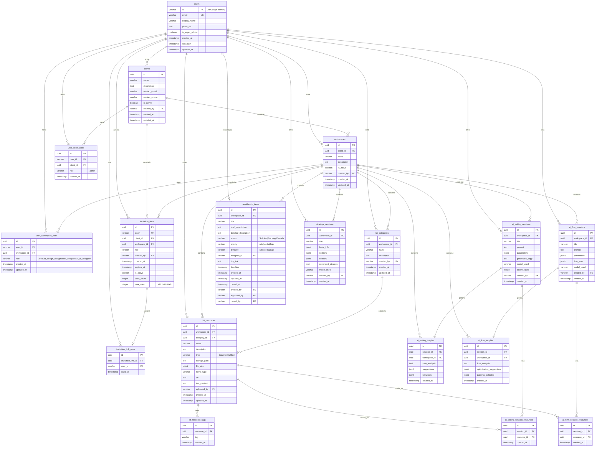

# DesignOS: AI Design System Toolkit - FASE 1

Sistema de Gestión de Diseño con IA
Noviembre 2025

---

## Control de versiones del documento

| Fecha   | Owner             | Versión | Estatus       |
| ------- | ----------------- | ------- | ------------- |
| Q4 2025 | Equipo Multiplica | 1.0     | En Definición |
|         |                   |         |               |
|         |                   |         |               |

---

## Índice

1. Resumen Ejecutivo
   1.1 Propósito del Producto
   1.2 Objetivos de Negocio
   1.3 Usuarios Target
2. Problema y Oportunidad
   2.1 Problema Actual
   2.2 Oportunidad
3. Alcance del Producto
   3.1 En Alcance (FASE 1 - MVP)
   3.2 Fuera de Alcance (FASE 2)
4. Requisitos Funcionales
   4.1 Sistema General y Autenticación
   4.2 Admin Panel - Gestión de Usuarios y Clientes
   4.3 Kit - Gestor de Recursos
   4.4 AI Writing - Generación de Copy
   4.5 AI Flow - Generación de Flujos
   4.6 Workbench - Gestión de Tareas
   4.7 Strategy - Estrategia de Sistema de Diseño
5. Requisitos No Funcionales
   5.1 Performance
   5.2 Escalabilidad
   5.3 Calidad
   5.4 Seguridad
   5.5 Usabilidad
6. Arquitectura Técnica
   6.1 Stack Tecnológico
   6.2 Flujos de IA
   6.3 Estructura de Datos
7. Flujo de Usuario
   7.1 Flujo Principal: Acceso y Navegación
   7.2 Flujos por Módulo
8. Métricas de Éxito
   8.1 KPIs de Producto
   8.2 KPIs Técnicos
   8.3 KPIs de Negocio
9. Roadmap
10. Riesgos y Mitigaciones
11. Dependencias
    11.1 Externas
    11.2 Internas
12. Aprobaciones
13. Historial de Cambios

---

## 1. Resumen Ejecutivo

### 1.1 Propósito del Producto

Product Designer es un sistema integral de gestión de diseño potenciado por IA que permite a equipos de diseño y producto gestionar, colaborar y acelerar el desarrollo de sistemas de diseño. La plataforma combina gestión de recursos, generación de contenido con IA, automatización de flujos, y herramientas colaborativas de gobernanza en un solo ecosistema.

### 1.2 Objetivos de Negocio

- **Aumentar eficiencia operativa**: Optimizar los procesos de diseño y desarrollo de producto mediante automatización e inteligencia artificial
- **Mejorar calidad y consistencia**: Garantizar coherencia en las entregas de diseño a través de centralización y gobernanza
- **Reducir time-to-market**: Acelerar significativamente los ciclos de producción de diseño
- **Democratizar capacidades avanzadas**: Permitir que equipos no técnicos aprovechen tecnologías de IA de forma intuitiva
- **Escalar el negocio**: Habilitar la gestión eficiente de múltiples clientes y proyectos de forma simultánea y segura
- **Fortalecer colaboración**: Facilitar la comunicación y el trabajo en equipo entre diferentes roles y disciplinas

### 1.3 Usuarios Target

- **Super Admin**: Responsable de la configuración y administración global del sistema completo, gestión de clientes y accesos globales
- **Admin de Cliente**: Administrador con acceso completo a su cliente específico, gestiona workspaces y usuarios de su organización
- **Product Design Lead**: Líder estratégico que supervisa la calidad, aprueba entregables y define lineamientos de diseño
- **Product Designer**: Profesional que ejecuta el diseño de producto, solicita y crea entregables con apoyo de IA
- **UX/UI Designer**: Especialista en experiencia e interfaz que utiliza herramientas del sistema para acelerar su trabajo creativo

---

## 2. Problema y Oportunidad

### 2.1 Problema Actual

- **Dispersión de información**: Equipos de diseño trabajan con información fragmentada en múltiples ubicaciones sin organización centralizada
- **Ineficiencia operativa**: Procesos manuales repetitivos que consumen tiempo valioso y retrasan la entrega
- **Falta de trazabilidad**: Ausencia de registro histórico que dificulta el seguimiento de decisiones y evolución del diseño
- **Herramientas desintegradas**: Uso simultáneo de múltiples plataformas sin interconexión que fragmenta los flujos de trabajo
- **Inconsistencia en entregas**: Dificultad para mantener estándares de calidad y coherencia en todos los proyectos
- **Brecha tecnológica**: Limitaciones para adoptar tecnologías emergentes debido a complejidad técnica

### 2.2 Oportunidad

- **Inteligencia Artificial**: Aprovechamiento de tecnologías de IA generativa para automatizar tareas creativas y acelerar la producción
- **Infraestructura moderna**: Uso de soluciones cloud que permiten escalabilidad, reducción de costos y menor complejidad operativa
- **Arquitectura escalable**: Diseño de sistemas que permiten crecimiento orgánico y gestión segura de múltiples clientes
- **Desarrollo modular**: Estrategia técnica que facilita la evolución independiente de capacidades y equipos
- **Unificación de procesos**: Consolidación de múltiples flujos de trabajo en una plataforma integrada que mejora la eficiencia

---

## 3. Alcance del Producto

### 3.1 En Alcance (FASE 1 - MVP)

✅ **Sistema General**

- Autenticación con GCP
- Sistema de roles (Super Admin, Admin de Cliente, Product Design Lead, Product Designer, UX/UI Designer)
- Arquitectura de workspaces aislados por cliente con jerarquía Cliente > Workspace
- Navegación centralizada entre módulos
- Testing unitario y de integracion

✅ **Admin Panel - Gestión de Usuarios y Clientes**

- Creación y gestión de clientes
- Creación y gestión de workspaces por cliente
- Visualización de usuarios del sistema
- Edición de datos de usuarios
- Asignación de roles por workspace
- Asignación de usuarios a workspaces
- Generación de links de invitación (Admins y Product Design Leads)
- Links de invitación con expiración y uso único/múltiple
- Gestión y revocación de links de invitación
- Super Admin: Capacidad de cambiar a cualquier workspace para pruebas, desarrollo y control de calidad

✅ **Kit - Gestor de Recursos**

- Creación de categorías de recursos
- Subida de documentos (Word, PDF, archivos de texto)
- Gestión de enlaces/URLs
- Navegador de archivos por categoría
- Buscador por títulos y descripciones
- Metadatos de archivos (autor, fecha de subida, etc)

✅ **AI Writing - Generación de Copy**

- Generación de copy y microcopy con agentes AI
- Segmentación por ciudad y audiencia
- Conexión con recursos de Kit
- Generación de insights
- Historial de sesiones junto con insights
- Vista de historial estilo sidebar

✅ **AI Flow - Generación de Flujos**

- Generación de borradores de flujos con agentes AI
- Formato JSON compatible con diagramas de Figma
- Generacion de insights
- Historial de sesiones estilo sidebar
- Función de copiar resultado JSON

✅ **Workbench - Gestión de Tareas**

- Sistema de solicitudes de tareas (Requests)
- Backlog de tareas aprobadas
- Gestión manual de tareas (sin integración con PM tools)
- Aprobación de solicitudes (solo Product Design Lead)
- Asignación de usuarios registrados en el sistema
- Campos: Titulo, descripción con formato, prioridad, usuario solicitante, usuario champion, usuario asignado, fecha de creación, link JIRA, fecha límite, dificultad, votos
- Filtros básicos (asignados a mí, prioridad, mostrar terminados)
- Ordenamiento por fecha de creación, estado, prioridad, fecha límite
- Edición rápida de datos en table view

✅ **Strategy - Estrategia de Sistema de Diseño**

- Generación de estrategia para sistema de diseño
- Interface con formularios estructurados
- Guardado de sesiones de estrategia
- Historial de sesiones estilo sidebar

### 3.2 Fuera de Alcance (FASE 2)

❌ Onboarding - Tour guiado
❌ Integración con herramientas de PM (JIRA API, etc.) [Workbench]
❌ Búsqueda vectorizada en contenido de documentos [Kit]
❌ Conexión directa con plugin de Figma [AI Flow]
❌ Gestión avanzada de Sprints [Workbench]
❌ Espacios personales [Kit]
❌ Espacios compartidos entre workspaces de cliente [Kit]
❌ Buscador de tareas [Workbench]
❌ Persistencia de preferencias de ordenamiento y filtros [Workbench]

## 4. Requisitos Funcionales

### 4.1 Sistema General y Autenticación

**RF-001: Autenticación de Usuarios**
**Descripción:** Los usuarios pueden acceder al sistema mediante autenticación directa o a través de links de invitación generados por admins o Product Design Leads.

**Criterios de Aceptación:**

**Flujo de Registro/Login Directo:**

- Implementacion de modulo de creacion de cuenta
- Implementacion de modulo de recuperacion de contraseña
- El usuario accede a la pantalla de login
- Se presenta opción de login con contraseña o algunos proveedores de auth
- El sistema valida credenciales con Google Identity Platform
- Usuario autenticado es redirigido al primer elemento del listado o dashboard
- Todo usuario debe tener al menos un workspace asignado para usar el sistema

**Flujo de Invitación por Link:**

- Usuario recibe link de invitación generado por Admin o Product Design Lead
- Al hacer clic en el link, es redirigido a pantalla de registro/login
- Link contiene token que asocia al usuario con cliente y workspace específico
- Usuario puede registrarse (nueva cuenta) o hacer login (cuenta existente)
- Tras autenticación, usuario queda automáticamente asignado al cliente/workspace del link con rol obligatorio
- Link de invitación tiene fecha de expiración configurable
- Link puede ser de un solo uso o de usos múltiples (configurable al generarlo)

**General:**

- Sesión persiste entre recargas de página
- Logout cierra sesión y redirige a login
- Todos los usuarios deben tener al menos un workspace asignado (asegurado por flujo de invitación o asignación por admin)

**Prioridad:** Alta
**Complejidad:** Media

**RF-002: Sistema de Roles y Permisos**
**Descripción:** El sistema debe implementar control de acceso basado en roles por workspace, con dos niveles de administración (Super Admin y Admin de Cliente).

**Criterios de Aceptación:**

- Roles disponibles: Super Admin, Admin de Cliente, Product Design Lead, Product Designer, UX/UI Designer
- Super Admin: Acceso global a todo el sistema, todos los clientes y workspaces
- Super Admin puede cambiar a cualquier workspace y actuar con permisos completos en ese workspace (para pruebas, desarrollo y control de calidad)
- Admin de Cliente: Acceso completo a su cliente específico y todos sus workspaces
- Los roles Product Design Lead, Product Designer y UX/UI Designer se asignan por workspace
- Un usuario puede tener un solo rol por workspace, pero puede estar asignado a múltiples workspaces con diferentes roles
- Admin de Cliente tiene capacidades administrativas sobre usuarios de su cliente
- Arquitectura que permite definir permisos específicos por módulo/funcionalidad
- Sistema de validación de permisos considerando nivel de admin y workspace actual
- Super Admin siempre tiene acceso completo al cambiar a cualquier workspace
- Mensajes claros cuando usuario no tiene permisos suficientes
- Persistencia de roles en base de datos asociados a relación usuario-workspace-cliente

**Prioridad:** Alta
**Complejidad:** Alta

**RF-003: Gestión de Clientes y Workspaces**
**Descripción:** El sistema debe implementar jerarquía de Clientes y Workspaces con aislamiento total de datos.

**Criterios de Aceptación:**

- Jerarquía: Cliente > Workspace (un cliente puede tener múltiples workspaces)
- Los datos de un workspace están completamente aislados de otros workspaces
- Los datos de un cliente están completamente aislados de otros clientes
- Usuario puede estar asignado a múltiples workspaces de uno o más clientes
- Usuario puede cambiar entre workspaces autorizados mediante selector
- Cada workspace tiene su propia configuración de recursos y datos
- Workspace ID se usa como partición en todas las colecciones de datos
- Cliente ID se usa para agrupar workspaces relacionados

**Prioridad:** Alta
**Complejidad:** Alta

**RF-004: Navegación Global**
**Descripción:** Proporcionar sistema de navegación consistente entre módulos con selector de workspace y capacidad de cambio de contexto.

**Criterios de Aceptación:**

- Sidebar con acceso a todos los módulos de FASE 1
- Selector de workspace que muestra workspaces disponibles para el usuario
- Super Admin ve todos los clientes y workspaces en el selector
- Super Admin puede cambiar a cualquier workspace y actuar con permisos completos dentro de ese workspace
- Admin de Cliente ve solo workspaces de su cliente en el selector
- Cambio de workspace actualiza todo el contexto de la aplicación y aísla el ambiente
- Al cambiar de workspace, Super Admin tiene acceso completo a todos los módulos de ese workspace
- Indicador visual de módulo activo
- Indicador visual de workspace y cliente actual
- Acceso a perfil de usuario y logout
- Solo Super Admins y Admins de Cliente ven acceso al Admin Panel en el sidebar
- Navegación preserva contexto de workspace actual
- Iconos o emojis identifican cada módulo

**Prioridad:** Alta
**Complejidad:** Baja

### 4.2 Admin Panel - Gestión de Usuarios y Clientes

**RF-005: Gestión de Clientes**
**Descripción:** Los Super Admins pueden crear y gestionar clientes en el sistema.

**Criterios de Aceptación:**

- Solo Super Admins tienen acceso a gestión de clientes
- Crear nuevos clientes con nombre, información de contacto y configuración
- Editar información de clientes existentes
- Ver listado de todos los clientes del sistema
- Asignar Admins de Cliente a clientes específicos
- Desactivar/activar clientes (soft delete)
- Cada cliente tiene un ID único que agrupa sus workspaces

**Prioridad:** Alta
**Complejidad:** Media

**RF-006: Gestión de Workspaces**
**Descripción:** Los Super Admins y Admins de Cliente pueden crear y gestionar workspaces dentro de clientes.

**Criterios de Aceptación:**

- Super Admin puede crear workspaces en cualquier cliente
- Admin de Cliente puede crear workspaces solo en su cliente asignado
- Crear workspace con nombre, descripción y cliente asociado
- Editar configuración de workspaces existentes
- Super Admin ve listado de workspaces de todos los clientes
- Admin de Cliente ve solo workspaces de su cliente
- Desactivar/activar workspaces (soft delete)
- Cada workspace tiene configuración independiente

**Prioridad:** Alta
**Complejidad:** Media

**RF-007: Gestión de Usuarios**
**Descripción:** Los Super Admins y Admins de Cliente pueden ver, editar y gestionar usuarios.

**Criterios de Aceptación:**

- Super Admin ve listado de todos los usuarios del sistema
- Admin de Cliente ve solo usuarios asignados a workspaces de su cliente
- Buscar usuarios por nombre, email o rol
- Editar información básica de usuarios (nombre, email, estado)
- Ver en qué workspaces está asignado cada usuario
- Ver qué roles tiene cada usuario en cada workspace
- Super Admin puede desactivar/activar cualquier usuario
- Admin de Cliente puede desactivar/activar usuarios de su cliente
- Filtrar usuarios por cliente, workspace o rol (según permisos)

**Prioridad:** Alta
**Complejidad:** Media

**RF-008: Asignación de Roles por Workspace**
**Descripción:** Los Super Admins y Admins de Cliente pueden asignar y modificar roles de usuarios en workspaces.

**Criterios de Aceptación:**

- Super Admin puede asignar roles en cualquier workspace de cualquier cliente
- Admin de Cliente puede asignar roles solo en workspaces de su cliente
- Admin de Cliente solo puede asignar roles: Product Design Lead, Product Designer, UX/UI Designer
- Super Admin puede asignar cualquier rol incluyendo Admin de Cliente
- Asignar un rol a un usuario en un workspace (un solo rol por workspace)
- Un usuario puede estar asignado a múltiples workspaces con diferentes roles en cada uno
- Modificar rol existente de usuario en un workspace (reemplaza el rol anterior)
- Remover acceso de usuario a un workspace
- Ver historial de cambios de roles (auditoría básica)

**Prioridad:** Alta
**Complejidad:** Alta

**RF-009: Asignación de Usuarios a Workspaces**
**Descripción:** Los Super Admins y Admins de Cliente pueden asignar usuarios existentes a workspaces para darles acceso.

**Criterios de Aceptación:**

- Super Admin puede agregar usuarios existentes a cualquier workspace
- Admin de Cliente puede agregar usuarios existentes solo a workspaces de su cliente
- Agregar usuarios con un rol definido (obligatorio)
- Remover usuarios de workspaces (según permisos)
- Ver listado de usuarios asignados por workspace
- Usuario debe estar asignado a al menos un workspace con un rol para usar el sistema
- Al asignar usuario se define obligatoriamente su rol en ese workspace
- Un usuario puede ser asignado a múltiples workspaces, cada uno con su propio rol

**Prioridad:** Alta
**Complejidad:** Media

**RF-010: Generación de Links de Invitación**
**Descripción:** Admins y Product Design Leads pueden generar links de invitación para incorporar nuevos usuarios al sistema.

**Criterios de Aceptación:**

- Super Admin puede generar links para cualquier cliente y workspace
- Admin de Cliente puede generar links solo para workspaces de su cliente
- Product Design Lead puede generar links para cualquier workspace donde tenga ese rol (el workspace debe estar activo/seleccionado)
- Al generar link se especifica:
  - Cliente y workspace de destino
  - Rol que tendrá el usuario invitado
  - Fecha de expiración del link
  - Número máximo de usos (1 para un solo uso, NULL para ilimitados, N para N usos)
- Link generado es único y contiene token encriptado
- Link se puede copiar para compartir por email, Slack, etc.
- Sistema muestra listado de links generados con su estado (activo, expirado, usado)
- Admins pueden revocar links antes de su expiración
- Al usar el link, nuevo usuario se registra/loguea y queda asignado automáticamente
- Usuario invitado recibe el rol especificado en el link

**Escenarios de Usuario Existente:**

- Si usuario ya tiene acceso al workspace: se muestra mensaje indicando que ya tiene acceso y se ofrece actualizar su rol
- Si usuario no tiene acceso al workspace: se agrega automáticamente con el rol especificado
- Si usuario tiene acceso con diferente rol: se pregunta si quiere actualizar el rol o mantener el existente
- El sistema advierte al usuario antes de cambiar su rol existente

**Prioridad:** Alta
**Complejidad:** Alta

### 4.3 Kit - Gestor de Recursos

**RF-011: Crear Categorías de Recursos**
**Descripción:** Los usuarios pueden crear categorías para organizar recursos de diseño.

**Criterios de Aceptación:**

- Usuario ingresa título y descripción de categoría
- Se asigna ID único automáticamente (UUID)
- Categoría se asocia al workspace actual
- Se crea registro en tabla `kit_categories`
- Categorías se muestran en vista de listado

**Prioridad:** Alta
**Complejidad:** Baja

**RF-012: Subir Documentos**
**Descripción:** Los usuarios pueden subir archivos de diferentes formatos a categorías.

**Criterios de Aceptación:**

- Formatos soportados: Word (.doc, .docx), PDF (.pdf), Texto (.txt, .md)
- Usuario selecciona categoría destino
- Usuario ingresa nombre y descripción del archivo
- Archivo se sube a Google Cloud Storage
- Metadatos se guardan en tabla `kit_resources`
- Metadatos incluyen: autor (uid), fecha de subida, tamaño, tipo
- Feedback visual durante subida (progress bar)
- Validación de tamaño máximo (definir límite)

**Prioridad:** Alta
**Complejidad:** Media

**RF-013: Agregar Enlaces/URLs**
**Descripción:** Los usuarios pueden agregar referencias externas como recursos.

**Criterios de Aceptación:**

- Usuario ingresa URL, título y descripción
- Sistema valida formato de URL
- Se guarda en tabla `kit_resources` como recurso tipo "url"
- Enlaces se muestran con ícono diferenciador en navegador

**Prioridad:** Media
**Complejidad:** Baja

**RF-014: Navegador de Archivos por Categoría**
**Descripción:** Los usuarios pueden explorar archivos dentro de cada categoría.

**Criterios de Aceptación:**

- Al seleccionar categoría, se abre vista de navegador
- Se muestran todos los recursos de esa categoría
- Vista incluye: nombre, descripción, tipo, autor, fecha
- Recursos se pueden ordenar por fecha, nombre, tipo
- Se muestra ícono según tipo de recurso
- Click en recurso permite descargarlo o verlo

**Prioridad:** Alta
**Complejidad:** Media

**RF-015: Buscador de Recursos**
**Descripción:** Los usuarios pueden buscar recursos por título y descripción.

**Criterios de Aceptación:**

- Campo de búsqueda visible en vista principal de Kit
- Búsqueda en tiempo real mientras usuario escribe
- Busca coincidencias en: título de categoría, título de recurso, descripción
- Resultados destacan coincidencias
- Búsqueda es case-insensitive
- Nota: Búsqueda en contenido de documentos está fuera de alcance

**Prioridad:** Media
**Complejidad:** Media

**RF-016: Gestión de Permisos de Recursos**
**Descripción:** Control de quién puede subir y eliminar recursos.

**Criterios de Aceptación:**

- Por ahora, permisos son a nivel workspace (todos los usuarios del workspace)
- Todos los usuarios de un workspace pueden: subir archivos, ver archivos, eliminar archivos
- Nota: Espacios personales y niveles granulares de permisos están fuera de alcance FASE 1
- Sistema registra quién subió cada archivo en metadatos

**Prioridad:** Media
**Complejidad:** Baja

**RF-017: Eliminar Recursos**
**Descripción:** Los usuarios pueden eliminar recursos que ya no son necesarios.

**Criterios de Aceptación:**

- Botón de eliminar visible en cada recurso
- Confirmación antes de eliminar
- Elimina archivo de Cloud Storage
- Elimina registro de la base de datos
- Actualiza vista inmediatamente
- Solo usuarios del workspace pueden eliminar

**Prioridad:** Baja
**Complejidad:** Baja

### 4.4 AI Writing - Generación de Copy

**RF-018: Generar Copy con IA**
**Descripción:** Los usuarios pueden generar copy y microcopy usando Gemini API con parámetros personalizados.

**Criterios de Aceptación:**

- Usuario ingresa prompt descriptivo
- Usuario puede especificar: ciudad, audiencia, tono, longitud
- Sistema construye prompt enriquecido con contexto
- Envía request a Gemini API
- Muestra indicador de progreso durante generación
- Muestra resultado en área de texto editable
- Usuario puede copiar resultado
- Tiempo de respuesta < 10 segundos en 90% de casos

**Prioridad:** Alta
**Complejidad:** Media

**RF-019: Conectar Recursos de Kit**
**Descripción:** Los usuarios pueden seleccionar recursos de Kit como contexto para generación.

**Criterios de Aceptación:**

- Botón "Usar recursos de Kit" abre dialog de selección
- Dialog muestra navegador de archivos de Kit
- Usuario puede buscar y seleccionar múltiples recursos
- Recursos seleccionados se muestran como chips/badges
- Contenido de recursos se extrae y añade al contexto del prompt
- Procesamiento de Word con librería Mammoth
- Procesamiento de PDF con pdfjs-dist
- URLs se incluyen como referencia en prompt

**Prioridad:** Alta
**Complejidad:** Alta

**RF-020: Generación de Insights Automáticos**
**Descripción:** El sistema genera insights sobre el copy producido automáticamente.

**Criterios de Aceptación:**

- Al generar copy, se genera insight relacionado simultáneamente
- Insight incluye: análisis de tono, sugerencias de mejora, keywords detectados
- Se guarda en tabla `ai_writing_insights`
- Insight se asocia a la sesión de generación
- Se muestra en panel lateral o sección separada

**Prioridad:** Media
**Complejidad:** Media

**RF-021: Mini-título de Sesión**
**Descripción:** Cada sesión de AI Writing recibe un título descriptivo corto generado automáticamente.

**Criterios de Aceptación:**

- Al crear nueva sesión, se genera título basado en prompt del usuario
- Título tiene máximo 50 caracteres
- Estilo similar a ChatGPT: "Genera copy para..."
- Si el prompt es muy largo, se resume inteligentemente
- Título se muestra en historial de sesiones

**Prioridad:** Media
**Complejidad:** Baja

**RF-022: Historial de Sesiones**
**Descripción:** Los usuarios pueden acceder a todas las sesiones de AI Writing previas.

**Criterios de Aceptación:**

- Vista de historial en sidebar lateral
- Cada elemento muestra: mini-título, fecha, snippet del resultado
- Sesiones ordenadas por fecha (más reciente primero)
- Click en sesión la carga en área principal
- Historial es por workspace
- Historial incluye todos los inputs y outputs de la sesión

**Prioridad:** Alta
**Complejidad:** Media

**RF-023: Eliminar Sesiones del Historial**
**Descripción:** Los usuarios pueden eliminar sesiones que ya no necesitan.

**Criterios de Aceptación:**

- Ícono de eliminar en cada elemento del historial
- Confirmación antes de eliminar
- Elimina sesión e insights asociados de la base de datos
- Actualiza historial inmediatamente
- Si sesión activa es eliminada, muestra vista vacía

**Prioridad:** Baja
**Complejidad:** Baja

### 4.5 AI Flow - Generación de Flujos

**RF-024: Generar Flujos con IA**
**Descripción:** Los usuarios pueden generar borradores de flujos de usuario en formato JSON.

**Criterios de Aceptación:**

- Usuario ingresa descripción del flujo deseado
- Usuario puede especificar: objetivo, puntos de decisión, estados
- Sistema genera JSON compatible con diagramas de flujo de Figma
- Formato JSON incluye: nodos, conexiones, labels, tipos de nodo
- Muestra indicador de progreso durante generación
- Resultado se muestra en editor JSON con syntax highlighting
- Tiempo de respuesta < 15 segundos en 90% de casos

**Prioridad:** Alta
**Complejidad:** Media

**RF-025: Generar Microcopy para Flujos**
**Descripción:** El sistema genera microcopy apropiado para cada paso del flujo.

**Criterios de Aceptación:**

- Microcopy se genera como parte del flujo
- Cada nodo incluye textos relevantes: títulos, descripciones, CTAs
- Microcopy es consistente con tone of voice si se usan recursos de Kit
- Se puede regenerar microcopy sin regenerar flujo completo

**Prioridad:** Media
**Complejidad:** Media

**RF-026: Copiar Resultado JSON**
**Descripción:** Los usuarios pueden copiar el JSON generado al portapapeles.

**Criterios de Aceptación:**

- Botón "Copiar JSON" visible junto al resultado
- Al hacer clic, copia todo el JSON al portapapeles
- Feedback visual confirma que se copió exitosamente
- JSON copiado está formateado correctamente
- Nota: Integración directa con plugin de Figma está fuera de alcance FASE 1

**Prioridad:** Alta
**Complejidad:** Baja

**RF-027: Guardar Insights de Flujos**
**Descripción:** El sistema permite guardar insights sobre los flujos generados.

**Criterios de Aceptación:**

- Botón "Guardar Insights" visible en interfaz
- Al guardar, se crea registro en tabla `ai_flow_insights`
- Insight incluye: análisis del flujo, sugerencias de optimización, patrones detectados
- Nota: Aún por definir si se muestran en sidebar como AI Writing o de otra forma
- Insights se asocian a la sesión de flujo

**Prioridad:** Baja
**Complejidad:** Media

**RF-028: Historial de Sesiones de Flujos**
**Descripción:** Los usuarios pueden acceder a sesiones previas de generación de flujos.

**Criterios de Aceptación:**

- Vista de historial consistente con AI Writing (sidebar)
- Cada elemento muestra: mini-título, fecha, snippet/thumbnail del flujo
- Click en sesión carga el flujo completo
- Historial es por workspace
- Sesiones ordenadas por fecha descendente

**Prioridad:** Alta
**Complejidad:** Media

**RF-029: Conectar Recursos de Kit en AI Flow**
**Descripción:** Los usuarios pueden usar recursos de Kit como contexto para flujos.

**Criterios de Aceptación:**

- Funcionalidad idéntica a RF-019 (Conectar Recursos de Kit en AI Writing)
- Dialog de selección de recursos compartido entre módulos
- Recursos seleccionados enriquecen el contexto del prompt
- Se pueden usar guidelines, ejemplos de flujos previos, etc.

**Prioridad:** Media
**Complejidad:** Media

### 4.6 Workbench - Gestión de Tareas

**RF-030: Crear Solicitud de Tarea (Request)**
**Descripción:** Los usuarios pueden proponer nuevas tareas de diseño.

**Criterios de Aceptación:**

- Formulario con campos: título, descripción breve, prioridad
- Todos los roles pueden crear solicitudes
- Estado inicial: "Solicitud"
- Se crea registro en tabla `workbench_tasks`
- Solicitud aparece en tab "Solicitudes"
- Se registra autor (uid) y fecha de creación

**Prioridad:** Alta
**Complejidad:** Baja

**RF-031: Aprobar Solicitud a Backlog**
**Descripción:** Product Design Lead puede aprobar solicitudes para que pasen a Backlog.

**Criterios de Aceptación:**

- Solo rol "Product Design Lead" puede aprobar
- Botón "Aprobar" visible en cada solicitud (solo para PD Lead)
- Al aprobar, estado cambia a "Backlog"
- Tarea desaparece de "Solicitudes" y aparece en "Backlog"
- Se registra quién aprobó y cuándo
- Otros roles ven solicitudes pero no pueden aprobar

**Prioridad:** Alta
**Complejidad:** Media

**RF-032: Asignar Usuarios a Tareas**
**Descripción:** Las tareas pueden ser asignadas a usuarios registrados en el sistema.

**Criterios de Aceptación:**

- Campo "Asignado a" permite seleccionar de lista de usuarios del workspace
- Solo se muestran usuarios registrados y con acceso al workspace
- Se puede buscar usuarios por nombre
- Tarea puede estar sin asignar (opcional)
- Se puede cambiar asignación en cualquier momento

**Prioridad:** Alta
**Complejidad:** Media

**RF-033: Descripción Detallada con Formato**
**Descripción:** Las tareas incluyen descripción rica con formato.

**Criterios de Aceptación:**

- Editor de texto rico para descripción detallada
- Soporta: negritas, cursivas, bullets, listas numeradas
- Se guarda en formato HTML o Markdown
- Se muestra renderizado al ver detalle de tarea
- Accesible al hacer click en tarea

**Prioridad:** Media
**Complejidad:** Media

**RF-034: Campos Adicionales de Tarea**
**Descripción:** Las tareas incluyen campos para gestión completa.

**Criterios de Aceptación:**

- Campo "Link JIRA": URL al ticket correspondiente en JIRA
- Campo "Fecha límite": Date picker para deadline
- Campo "Dificultad": Selector (Baja/Media/Alta)
- Todos los campos son editables en cualquier momento
- Campos se muestran en vista de detalle y resumen

**Prioridad:** Media
**Complejidad:** Baja

**RF-035: Edición Rápida de Datos**
**Descripción:** Los datos de tareas se pueden editar sin flujos complejos.

**Criterios de Aceptación:**

- Click en cualquier campo lo hace editable
- Cambios se guardan automáticamente al salir del campo (blur)
- Feedback visual durante guardado
- No se requieren botones "Editar" o "Guardar" separados
- Cambios persisten en la base de datos inmediatamente

**Prioridad:** Alta
**Complejidad:** Media

**RF-036: Filtros Básicos**
**Descripción:** Los usuarios pueden filtrar tareas según criterios comunes.

**Criterios de Aceptación:**

- Filtro "Asignados a mí": Muestra solo tareas donde usuario actual es asignado
- Filtro "Prioridad": Filtrar por Alta/Media/Baja
- Filtro "Mostrar terminadas": Checkbox para incluir/excluir tareas cerradas
- Filtros se pueden combinar
- Por defecto, tareas cerradas NO se muestran
- Filtro de "Mostrar terminadas" se resetea al recargar página

**Prioridad:** Alta
**Complejidad:** Media

**RF-037: Ordenamiento de Tareas**
**Descripción:** Los usuarios pueden ordenar tareas por diferentes criterios.

**Criterios de Aceptación:**

- Opciones de ordenamiento: Fecha de creación, Prioridad, Fecha límite
- Orden ascendente/descendente
- Orden seleccionado se aplica inmediatamente
- Preferencia de orden NO se persiste entre sesiones (se resetea al recargar página) - FASE 1
- Persistencia de preferencias queda para FASE 2

**Prioridad:** Media
**Complejidad:** Baja

**RF-038: Cerrar Tareas**
**Descripción:** Las tareas pueden marcarse como cerradas/completadas.

**Criterios de Aceptación:**

- Checkbox o botón "Cerrar" en cada tarea
- Estado cambia a "Cerrada"
- Tareas cerradas desaparecen de vista por defecto
- Solo visibles si filtro "Mostrar terminadas" está activo
- Se registra fecha de cierre y quién cerró

**Prioridad:** Media
**Complejidad:** Baja

**RF-039: Buscador de Tareas (FASE 2)**
**Descripción:** Los usuarios pueden buscar tareas por texto.

**Criterios de Aceptación:**

- Campo de búsqueda en vista de Workbench
- Busca en: título, descripción breve, descripción detallada
- Búsqueda en tiempo real
- Case-insensitive
- **MOVIDO A FASE 2:** Funcionalidad no crítica para MVP

**Prioridad:** Baja
**Complejidad:** Baja

### 4.7 Strategy - Estrategia de Sistema de Diseño

**RF-040: Formulario de Información Básica**
**Descripción:** Los usuarios pueden ingresar información fundamental del sistema de diseño.

**Criterios de Aceptación:**

- Sección "1. Información Básica" visible en interfaz
- Campos incluyen: nombre del sistema, descripción, objetivos, público objetivo
- Campos de texto con validación básica
- Datos se guardan en la base de datos al avanzar o guardar borrador
- Nota: Pueden existir más secciones no definidas aún en prototipo

**Prioridad:** Alta
**Complejidad:** Baja

**RF-041: Generar Estrategia con IA**
**Descripción:** El sistema genera una estrategia completa basada en inputs del usuario.

**Criterios de Aceptación:**

- Botón "Generar Estrategia" al completar formularios
- Sistema combina todos los inputs en metaprompt
- Envía request a Gemini API
- Genera documento de estrategia estructurado
- Incluye: análisis, recomendaciones, roadmap, métricas sugeridas
- Resultado se muestra en formato legible y descargable

**Prioridad:** Alta
**Complejidad:** Alta

**RF-042: Guardar Sesiones de Estrategia**
**Descripción:** Cada estrategia generada se guarda para referencia futura.

**Criterios de Aceptación:**

- Cada generación crea sesión en tabla `strategy_sessions`
- Sesión incluye: inputs del formulario, estrategia generada, fecha, autor
- Se asigna mini-título descriptivo automáticamente
- Sesiones son por workspace

**Prioridad:** Alta
**Complejidad:** Media

**RF-043: Historial de Estrategias**
**Descripción:** Los usuarios pueden ver y acceder a estrategias generadas previamente.

**Criterios de Aceptación:**

- Vista de historial consistente con otros módulos
- Muestra lista de sesiones con: título, fecha, snippet
- Click en sesión carga los datos completos
- Permite comparar estrategias diferentes
- Ordenado por fecha descendente

**Prioridad:** Alta
**Complejidad:** Media

**RF-044: Reparar Funcionalidad de Backend**
**Descripción:** Corregir errores en el prototipo existente de Strategy.

**Criterios de Aceptación:**

- Identificar errores actuales en conexión con APIs
- Corregir llamadas a Gemini API
- Estabilizar guardado en AlloyDB
- Validar que formularios funcionen end-to-end
- Testing de generación completa

**Prioridad:** Alta
**Complejidad:** Media

**RF-045: Módulos Adicionales del Formulario**
**Descripción:** Implementar formulario de Strategy según interfaz del prototipo existente.

**Criterios de Aceptación:**

- Usar la interfaz como está definida en el prototipo del Product Designer
- Implementar "1. Información Básica" como sección principal
- Mantener consistencia en navegación entre secciones
- Si el prototipo incluye secciones adicionales, implementarlas tal cual están diseñadas
- El Product Designer ya tenía la interfaz funcionando, seguir esa línea

**Prioridad:** Media
**Complejidad:** Media

---

## 5. Requisitos No Funcionales

### 5.1 Performance

- Tiempo de carga inicial: < 3 segundos para app shell
- Tiempo de carga de módulo remoto: < 2 segundos
- Generación con IA (AI Writing): < 10 segundos en 90% de casos
- Generación con IA (AI Flow): < 15 segundos en 90% de casos
- Generación con IA (Strategy): < 30 segundos en 90% de casos
- Subida de archivos: Progress feedback continuo, sin límite de tiempo fijo
- Búsquedas: Resultados en < 500ms

### 5.2 Escalabilidad

- Soportar hasta 1000 workspaces concurrentes en FASE 1
- Hasta 100 usuarios por workspace
- Hasta 10GB de storage por workspace
- Hasta 1000 recursos en Kit por workspace
- AlloyDB escala verticalmente con alta disponibilidad automática
- Cloud Storage para archivos escala automáticamente con GCP
- Arquitectura modular permite escalar componentes independientemente

### 5.3 Calidad

- Cobertura de tests: Aún no definida (definir en conjunto con equipo)
- Relevancia de copy generado: 80% aprobado sin edición mayor
- Validez de JSON de flujos: 100% compatible con estándar definido
- Estabilidad: < 3% error rate en generaciones de IA
- Consistencia UI: Uso de shadcn/ui para componentes compartidos

### 5.4 Seguridad

- Autenticación: Google Identity Platform obligatoria
- Autorización: Validación de roles en frontend y backend
- Aislamiento de workspace: Queries SQL siempre filtran por workspace ID usando Row Level Security (RLS)
- Super Admin: Tiene acceso completo a todos los workspaces al cambiarlos, actuando con permisos completos dentro de cada workspace
- Admin de Cliente: Acceso restringido solo a workspaces de su cliente mediante políticas RLS
- Datos sensibles: Almacenados en Google Cloud Secret Manager
- URLs de descarga: Signed URLs con expiración de Cloud Storage
- HTTPS: Todas las comunicaciones encriptadas
- AlloyDB: Políticas de Row Level Security (RLS) estrictas por workspace y usuario, con permisos especiales para Super Admins
- Encriptación: Datos en reposo encriptados en AlloyDB
- Auditoría: Logging de acciones de Super Admin cuando cambia entre workspaces y clientes

### 5.5 Usabilidad

- Interface responsive: Funcional en desktop (mobile fuera de alcance FASE 1)
- Feedback visual: Loading states, success/error messages claros
- Manejo de errores: Mensajes descriptivos y accionables
- Consistencia: UI/UX unificado entre módulos usando design system propio
- Accesibilidad: Cumplir WCAG 2.1 nivel AA (objetivo, aún no auditado)
- Navegación intuitiva: Máximo 3 clicks para cualquier acción principal

---

## 6. Arquitectura Técnica

### 6.1 Stack Tecnológico

**Frontend:**

- Framework: Next.js (versión a definir)
- UI Library: React (versión a definir)
- Styling: Tailwind CSS
- Component Library: shadcn/ui con MCP server
- TypeScript: Para type safety
- State Management: Zustand

**Backend/Cloud:**

- Cloud Provider: Google Cloud Platform (GCP)
- Authentication: Google Identity Platform
- Database Principal: AlloyDB para PostgreSQL (datos de aplicación)
- Database Secundaria: Google Cloud Firestore (configuraciones, settings, metadatos)
- Storage: Google Cloud Storage
- Serverless Compute: Google Cloud Run (para funciones necesarias)
- Logs: Google Cloud Logging
- Monitoring: Google Cloud Monitoring + Grafana
- Tracing: Google Cloud Trace
- Analytics: Google Analytics
- Secrets: Google Cloud Secret Manager

**IA:**

- Modelo principal: Gemini API (Google)
- Procesamiento de documentos:
  - Word: Mammoth.js
  - PDF: pdfjs-dist

**DevOps:**

- Version Control: GitHub
- CI/CD: GitHub Actions
- Deployment: Google Cloud Run (via GitHub Actions)

**Logging:**

- Logger: Pino

**Validation:**

- Schema validation: Zod (para contratos entre módulos y APIs)
- Type generation: Types compilados desde JSON y unificados con Zod

### 6.2 Flujos de IA

**Ubicación sugerida:** `src/ai/flows/`

**Flujos de FASE 1:**

- `generate-copy.ts`: Generación de copy y microcopy con contexto de marca
- `generate-insights-writing.ts`: Generación de insights para AI Writing
- `generate-flow-diagram.ts`: Generación de JSON para flujos de usuario
- `generate-flow-microcopy.ts`: Generación de microcopy específico para flujos
- `generate-design-strategy.ts`: Generación de estrategia completa de sistema de diseño
- `generate-session-title.ts`: Generación de mini-títulos para historial

**Nota:** Aún por definir si se usará Firebase Genkit (como en ejemplo de Agente de Imágenes) o implementación directa con Gemini API.

### 6.3 Estructura de Datos

**Base de Datos:** AlloyDB para PostgreSQL (datos de aplicación)

**Diagrama Entidad-Relación:**

**Notas sobre el Esquema:**

- **Jerarquía Principal:** `users` → `clients` → `workspaces` → datos por módulo
- **Aislamiento:** Todas las tablas de contenido tienen `workspace_id` para garantizar aislamiento de datos
- **Roles:** Sistema de doble nivel (cliente y workspace) con constraint `UNIQUE(user_id, workspace_id)` para un solo rol por workspace
- **Soft Delete:** Campos `is_active` en `clients` y `workspaces`
- **Auditoría:** Campos `created_by`, `created_at`, `updated_at` para trazabilidad
- **Invitaciones:** Sistema de links con expiración y contador de usos (`max_uses`)
- **Recursos Kit:** Polimórficos con campos opcionales según `type` (document, url, text)
- **Sesiones IA:** Vinculadas a recursos mediante tablas intermedias para contexto
- **JSONB:** Usado para datos flexibles (parameters, insights, estrategias)

**Configuraciones en Firestore:**

Las siguientes entidades se almacenan en Firestore por ser configuraciones/settings:

- `app_settings`: Configuraciones globales de la aplicación
- `workspace_settings`: Settings específicos por workspace (preferencias UI, etc.)
- `user_preferences`: Preferencias de usuario (tema, idioma, etc.)
- `feature_flags`: Feature toggles para desarrollo

---

## 7. Flujo de Usuario

### 7.1 Flujo Principal: Acceso y Navegación

1. Usuario accede a la URL de la aplicación
2. Sistema detecta que no está autenticado
3. Redirige a pantalla de login
4. Usuario hace clic en "Login con Google"
5. Google Identity Platform autentica al usuario
6. Sistema valida usuario y carga workspaces disponibles:
   - Super Admin: Ve todos los workspaces de todos los clientes
   - Admin de Cliente: Ve workspaces de su cliente
   - Otros roles: Ve workspaces donde está asignado
   - Nota: Todos los usuarios tienen al menos un workspace (garantizado por flujo de invitación o asignación por admin)
7. Usuario selecciona workspace activo (si tiene múltiples)
8. Sistema carga dashboard principal con navegación a módulos
9. Sidebar muestra módulos de FASE 1: Kit, AI Writing, AI Flow, Workbench, Strategy, Admin Panel (si es admin)
10. Usuario navega a módulo deseado
11. Módulo se carga con contexto de auth y workspace aislado
12. Usuario trabaja dentro del módulo
13. Puede cambiar de módulo sin perder contexto de workspace
14. Puede cambiar de workspace usando el selector (Super Admin puede cambiar a cualquier cliente y workspace)

### 7.2 Flujos por Módulo

**Kit:**

1. Usuario accede a Kit
2. Ve listado de categorías existentes
3. Crea nueva categoría (título + descripción)
4. Entra a la categoría
5. Sube archivos (Word/PDF/Texto) o agrega URLs
6. Ingresa nombre y descripción para cada recurso
7. Archivos se suben a Cloud Storage con progress bar
8. Ve navegador de archivos actualizado
9. Usa buscador para encontrar recursos específicos
10. Descarga o visualiza recursos según necesite

**AI Writing:**

1. Usuario accede a AI Writing
2. Ve historial de sesiones previas en sidebar
3. Crea nueva sesión
4. Ingresa prompt descriptivo
5. Configura parámetros: ciudad, audiencia, tono
6. (Opcional) Selecciona recursos de Kit como contexto
7. Hace clic en "Generar"
8. Sistema muestra indicador de progreso
9. Copy generado aparece en área editable
10. Insights se generan automáticamente y se muestran
11. Usuario puede copiar, editar, o regenerar
12. Sesión se guarda automáticamente en historial con mini-título

**AI Flow:**

1. Usuario accede a AI Flow
2. Ve historial de flujos previos en sidebar
3. Crea nueva sesión
4. Describe el flujo de usuario deseado
5. Especifica objetivos y puntos de decisión
6. (Opcional) Usa recursos de Kit para contexto
7. Hace clic en "Generar Flujo"
8. Sistema genera JSON del diagrama
9. JSON se muestra con syntax highlighting
10. Usuario puede hacer clic en "Copiar JSON"
11. (Opcional) Guarda insights sobre el flujo
12. Sesión se guarda en historial

**Workbench:**

1. Usuario accede a Workbench
2. Ve tabs: "Solicitudes" y "Backlog"
3. Crea nueva solicitud de tarea
4. Ingresa: título, descripción, prioridad, link JIRA
5. (Si es Product Design Lead) Aprueba solicitudes
6. Solicitud aprobada pasa a Backlog
7. En Backlog, hace clic en tarea para ver detalle
8. Edita campos directamente
9. Usa filtros: asignados a mí, prioridad
10. Ordena por fecha, prioridad, o deadline
11. Marca tareas como cerradas cuando completan

**Strategy:**

1. Usuario accede a Strategy
2. Ve historial de estrategias previas
3. Crea nueva estrategia
4. Completa formulario de "Información Básica"
5. Ingresa: nombre del sistema, descripción, objetivos, público
6. (Potencial) Completa secciones adicionales
7. Hace clic en "Generar Estrategia"
8. Sistema procesa inputs con Gemini API
9. Estrategia completa se genera y muestra
10. Documento incluye: análisis, recomendaciones, roadmap
11. Usuario puede descargar o guardar para comparar
12. Estrategia se guarda automáticamente en historial

**Admin Panel (Super Admin):**

1. Super Admin accede al sistema
2. Ve opción de "Admin Panel" en sidebar
3. Accede a Admin Panel
4. Ve dashboard con opciones: Clientes, Workspaces, Usuarios
5. Gestión de Clientes:
   - Crea nuevo cliente con información básica
   - Asigna Admin de Cliente al cliente
   - Edita o desactiva clientes existentes
6. Gestión de Workspaces:
   - Ve todos los workspaces de todos los clientes
   - Crea nuevos workspaces asignándolos a clientes
   - Edita configuración de workspaces
7. Gestión de Usuarios:
   - Ve lista completa de usuarios del sistema
   - Edita información de usuarios
   - Asigna un rol a usuarios en cualquier workspace (un solo rol por workspace)
   - Invita nuevos usuarios a cualquier cliente/workspace con rol obligatorio
8. Cambio de Cliente y Workspace:
   - Usa selector de cliente y workspace para cambiar a cualquier workspace
   - Al cambiar, el ambiente se aísla y tiene acceso completo a todos los módulos de ese workspace (Kit, AI Writing, AI Flow, Workbench, Strategy)
   - Puede crear, editar y probar funcionalidades con permisos completos dentro del workspace seleccionado
   - Útil para desarrollo y control de calidad
   - Puede volver al Admin Panel en cualquier momento
   - Todas las acciones quedan registradas en auditoría

**Admin Panel (Admin de Cliente):**

1. Admin de Cliente accede al sistema
2. Ve opción de "Admin Panel" en sidebar
3. Accede a Admin Panel (vista limitada a su cliente)
4. Ve opciones: Workspaces (de su cliente), Usuarios (de su cliente)
5. Gestión de Workspaces:
   - Ve solo workspaces de su cliente
   - Crea nuevos workspaces dentro de su cliente
   - Edita configuración de sus workspaces
6. Gestión de Usuarios:
   - Ve solo usuarios asignados a workspaces de su cliente
   - Edita información de sus usuarios
   - Asigna roles (Product Design Lead, Designer, UX/UI) en workspaces de su cliente
   - Invita nuevos usuarios a su cliente
   - Asigna usuarios a workspaces de su cliente

**Generación de Link de Invitación (Admin o Product Design Lead):**

1. Usuario con permisos (Super Admin, Admin de Cliente o Product Design Lead) accede a sección de invitaciones
2. Hace clic en "Generar Link de Invitación"
3. Completa formulario:
   - Selecciona workspace de destino (según permisos y workspace activo)
   - Product Design Lead solo puede generar links para el workspace donde actualmente está trabajando
   - Selecciona rol que tendrá el invitado (obligatorio)
   - Define fecha de expiración (24h, 7 días, 30 días, personalizado)
   - Define número máximo de usos (1 para un solo uso, NULL para ilimitados, N para N usos)
4. Sistema genera link único con token encriptado
5. Link se muestra con botón de "Copiar"
6. Usuario copia y comparte link (por email, Slack, etc.)
7. Ve listado de links generados con estados:
   - Activos, expirados, usados
   - Contador de usos
   - Usuarios que lo han usado
8. Puede revocar links activos antes de expiración

**Uso de Link de Invitación (Nuevo Usuario o Usuario Existente):**

1. Usuario recibe link de invitación (por email, Slack, etc.)
2. Hace clic en el link
3. Sistema valida token:
   - Si inválido o expirado: Muestra error
   - Si válido: Continúa flujo
4. Usuario es redirigido a pantalla de registro/login
5. Opciones disponibles:
   - Registrarse con nueva cuenta
   - Hacer login con cuenta existente
6. Usuario completa autenticación
7. Sistema verifica si usuario ya tiene acceso al workspace:
   - **Escenario A - Usuario sin acceso:** Asigna automáticamente al workspace con el rol especificado
   - **Escenario B - Usuario con acceso y mismo rol:** Muestra mensaje "Ya tienes acceso a este workspace"
   - **Escenario C - Usuario con acceso y diferente rol:** Pregunta si desea actualizar su rol y advierte del cambio
8. Sistema automáticamente:
   - Asigna usuario al cliente especificado en el link (si no estaba)
   - Asigna usuario al workspace especificado (si no tenía acceso)
   - Asigna/actualiza rol especificado en el link
   - Marca link como usado (incrementa contador)
   - Si max_uses = 1, desactiva el link
9. Usuario es redirigido al workspace asignado
10. Puede empezar a usar el sistema con su rol asignado

---

## 8. Métricas de Éxito

### 8.1 KPIs de Producto

- Adopción por módulo: 70% de usuarios activos usan al menos 3 módulos regularmente
- Frecuencia de uso: Usuarios acceden al menos 3 veces por semana
- Retención: 80% de usuarios activos al mes 3
- Satisfacción: NPS > 40 en primeros 6 meses
- Recursos en Kit: Promedio de 50+ recursos por workspace al mes 3
- Generaciones de IA: Promedio de 20+ generaciones por usuario por mes

### 8.2 KPIs Técnicos

- Uptime: > 99.5%
- Error rate: < 3% en operaciones de IA
- Latencia p95:
  - Carga de módulos: < 2 segundos
  - Generación AI Writing: < 10 segundos
  - Generación AI Flow: < 15 segundos
  - Generación Strategy: < 30 segundos
- Tasa de éxito de uploads: > 98%
- Costo por generación de IA: < $0.10 USD promedio

### 8.3 KPIs de Negocio

- Ahorro de tiempo: 70% reducción en tiempo de generación de copy vs manual
- ROI: Positivo en 6 meses de uso
- Escalabilidad de clientes: Capacidad de onboarding de 10+ workspaces por mes
- Reducción de herramientas: Consolidación de 3-5 herramientas en una plataforma
- Valor percibido: 80% de usuarios consideran la herramienta "indispensable" a los 3 meses

---

## 9. Roadmap

**FASE 1: MVP - Fundación (Q4 2025 - Q1 2026)**

- Sistema de autenticación
- Arquitectura modular escalable
- Sistema de roles y workspaces multi-tenant
- Admin Panel: Gestión de clientes, workspaces y usuarios con links de invitación
- Kit: Gestor de recursos completo (documentos, URLs, categorías)
- AI Writing: Generación de copy con historial y conexión a recursos
- AI Flow: Generación de flujos con JSON compatible con Figma
- Workbench: Gestión de solicitudes y backlog (sin integración externa)
- Strategy: Generación de estrategias de diseño con formularios
- UI con Tailwind + shadcn/ui
- Deploy en Google Cloud Run
- Testing unitario y de integración

**FASE 2: Analytics y Gobernanza (Q2 2026)**

- Dashboard: KPIs y métricas de uso por proyecto/componente/equipo
- Observer: Analytics de componentes y sistema de análisis con IA
- Changelog: Gestión de versiones y release notes por sprint
- Labs: Experimentación de componentes e ideación
- Onboarding: Tour guiado adaptativo por rol
- Risk Management: Identificación de riesgos de diseño

**FASE 3: Integraciones y Optimización (Q3 2026)**

- Integración con APIs de PM tools (JIRA, etc.) [Workbench]
- Búsqueda vectorizada en contenido de documentos [Kit]
- Conexión directa con plugin de Figma [AI Flow]
- Gestión avanzada de Sprints [Workbench]
- Espacios personales y compartidos entre workspaces [Kit]
- Buscador de tareas [Workbench]
- Persistencia de preferencias de ordenamiento y filtros [Workbench]

---

## 10. Riesgos y Mitigaciones

| Riesgo                                        | Probabilidad | Impacto | Mitigación                                                                                       |
| --------------------------------------------- | ------------ | ------- | ------------------------------------------------------------------------------------------------ |
| Costos de API de IA exceden presupuesto       | Media        | Alto    | Implementar rate limiting, caching de resultados similares, monitoreo continuo de costos         |
| Calidad de generaciones de IA inconsistente   | Media        | Medio   | Prompts optimizados, validación humana, feedback loop para mejorar prompts                       |
| Usuarios no adoptan múltiples módulos         | Media        | Alto    | Onboarding guiado, demos de valor, incentivos de uso cruzado entre módulos                       |
| Aislamiento de workspaces tiene fuga de datos | Baja         | Crítico | Revisión exhaustiva de Row Level Security (RLS), auditorías de seguridad, testing de aislamiento |
| Performance de búsqueda degrada con volumen   | Media        | Medio   | Implementar paginación, índices optimizados en AlloyDB, caché de búsquedas frecuentes            |
| Falta de claridad en roles y permisos         | Media        | Medio   | Documentación clara de matriz de permisos, UI que comunica limitaciones por rol                  |
| Dependencia de prototipo incompleto           | Alta         | Medio   | Sesiones de alineación con stakeholders, validación de alcance antes de implementar              |

---

## 11. Dependencias

### 11.1 Externas

- Google Cloud Platform: Disponibilidad y cuotas de servicios (AlloyDB, Firestore, Storage, Run, Identity Platform)
- Gemini API: Cuotas, latencia, y disponibilidad del modelo
- GitHub Actions: Para CI/CD
- Mammoth.js y pdfjs-dist: Librerías para procesamiento de documentos
- shadcn/ui: Disponibilidad de componentes y MCP server
- Next.js y React: Versiones y compatibilidad

### 11.2 Internas

- ✅ **RESUELTO:** Definición completa de Strategy - Usar interfaz del prototipo existente
- Matriz de permisos detallada: Definir exactamente qué puede hacer cada rol en cada módulo
- Permisos de Admin de Cliente: Validar alcance completo de funcionalidades administrativas
- UI de Admin Panel: Definir si Super Admin y Admin de Cliente ven interfaces diferentes o la misma con restricciones
- ✅ **RESUELTO:** Sistema de bypass de Super Admin - Super Admin cambia de workspace y tiene acceso completo
- ✅ **RESUELTO:** Auditoría de Super Admin - Logging de acciones cuando cambia entre workspaces y clientes
- Row Level Security (RLS) para Super Admin: Definir políticas que permitan acceso especial a Super Admins
- Esquema de base de datos AlloyDB: Validar y optimizar esquema completo con equipo de backend
- Migraciones de base de datos: Definir estrategia de migraciones usando herramientas como Prisma o TypeORM
- ✅ **RESUELTO:** Preferencias de usuario - No persisten en FASE 1, movido a FASE 2
- ✅ **RESUELTO:** Buscador de tareas - Movido a FASE 2
- Espacios personales vs compartidos: Definir modelo de permisos granular para Kit (FASE 2)
- Coordinación con David Reyna (Multiplica España): Para refinar requerimientos de AI Flow
- Linting y TS config: Establecer reglas estándar del equipo

---

## 12. Aprobaciones

| Rol           | Nombre      | Fecha     | Firma |
| ------------- | ----------- | --------- | ----- |
| Product Owner | [Pendiente] | Pendiente |       |
| Tech Lead     | [Pendiente] | Pendiente |       |
| Engineering   | [Pendiente] | Pendiente |       |
| UX Lead       | [Pendiente] | Pendiente |       |

---

## 13. Historial de Cambios

| Versión | Fecha      | Autor   | Cambios                                                                                                                                                                                                                                                                                                                                                                                                                                     |
| ------- | ---------- | ------- | ------------------------------------------------------------------------------------------------------------------------------------------------------------------------------------------------------------------------------------------------------------------------------------------------------------------------------------------------------------------------------------------------------------------------------------------- |
| 1.0     | 2025-11-28 | Sistema | Documento inicial generado basado en definiciones de equipo, draft técnico y arquitectura propuesta                                                                                                                                                                                                                                                                                                                                         |
| 1.1     | 2025-12-01 | Equipo  | Corrección de inconsistencias: RF-001 (usuarios siempre tienen workspace), RF-002/RF-004 (eliminado "modo de pruebas"), RF-008 (un rol por workspace), RF-009 (rol obligatorio), RF-010 (escenarios de usuario existente, simplificación max_uses), RF-029 (referencia corregida), RF-037 (no persistir preferencias), RF-039 (movido a FASE 2), RF-045 (usar interfaz existente), actualización de estructura de datos y flujos de usuario |
|         |            |         |                                                                                                                                                                                                                                                                                                                                                                                                                                             |
