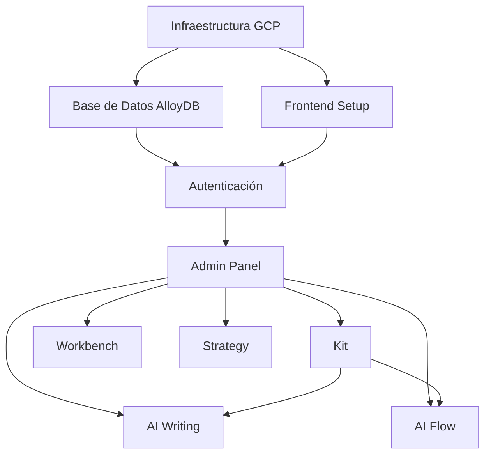

# Tareas JIRA - DesignOS: FASE 1

---

## EPIC: Sistema General y Autenticación

**Descripción:**
Implementar la infraestructura base del sistema incluyendo autenticación, roles, workspaces y navegación global.

**Story Points Estimados:** 34

### Subtareas:

#### [TASK-001] Implementar autenticación con Google Identity Platform

- Módulo de creación de cuenta
- Módulo de recuperación de contraseña
- Flujo de login/registro directo
- Flujo de invitación por link con token
- Persistencia de sesión
- Validación: usuario debe tener al menos un workspace asignado
- **Story Points:** 8
- **Prioridad:** Alta

#### [TASK-002] Implementar sistema de roles y permisos

- Configurar roles: Super Admin, Admin de Cliente, Product Design Lead, Product Designer, UX/UI Designer
- Un rol por workspace, múltiples workspaces por usuario
- Validación de permisos en frontend y backend
- Super Admin: acceso completo al cambiar workspace
- Admin de Cliente: acceso restringido a su cliente
- Mensajes de error claros para permisos insuficientes
- **Story Points:** 13
- **Prioridad:** Alta

#### [TASK-003] Implementar arquitectura de clientes y workspaces

- Jerarquía: Cliente > Workspace
- Aislamiento total de datos por workspace
- Selector de workspace con cambio de contexto
- Workspace ID como partición en todas las colecciones
- Row Level Security (RLS) en AlloyDB
- **Story Points:** 13
- **Prioridad:** Alta

#### [TASK-004] Implementar navegación global

- Sidebar con acceso a todos los módulos
- Selector de workspace funcional
- Indicadores visuales de módulo activo y workspace actual
- Iconos/emojis para cada módulo
- Acceso a perfil de usuario y logout
- Admin Panel visible solo para admins
- **Story Points:** 5
- **Prioridad:** Alta

---

## EPIC: Admin Panel - Gestión de Usuarios y Clientes

**Descripción:**
Panel administrativo para gestión de clientes, workspaces, usuarios y sistema de invitaciones.

**Story Points Estimados:** 34

### Subtareas:

#### [TASK-005] Implementar gestión de clientes

- CRUD de clientes (solo Super Admin)
- Listado de todos los clientes
- Asignación de Admins de Cliente
- Soft delete (activar/desactivar)
- **Story Points:** 5
- **Prioridad:** Alta

#### [TASK-006] Implementar gestión de workspaces

- CRUD de workspaces
- Super Admin: todos los clientes
- Admin de Cliente: solo su cliente
- Asociación workspace-cliente
- Soft delete
- **Story Points:** 5
- **Prioridad:** Alta

#### [TASK-007] Implementar gestión de usuarios

- Visualización de usuarios del sistema
- Búsqueda por nombre, email, rol
- Edición de información básica
- Ver workspaces y roles por usuario
- Activar/desactivar usuarios
- Filtros por cliente, workspace, rol
- **Story Points:** 8
- **Prioridad:** Alta

#### [TASK-008] Implementar asignación de roles por workspace

- Asignar un rol a usuario en workspace
- Modificar rol existente (reemplaza anterior)
- Remover acceso a workspace
- Historial de cambios de roles (auditoría básica)
- Restricciones por tipo de admin
- **Story Points:** 8
- **Prioridad:** Alta

#### [TASK-009] Implementar sistema de links de invitación

- Generación de links con token encriptado
- Configuración: cliente, workspace, rol, expiración, max_uses
- Listado de links generados con estados
- Revocación de links activos
- Flujo de uso del link (nuevo usuario y usuario existente)
- Escenarios: usuario sin acceso, mismo rol, diferente rol
- Registro de usos en tabla invitation_link_uses
- **Story Points:** 13
- **Prioridad:** Alta

---

## EPIC: Kit - Gestor de Recursos

**Descripción:**
Sistema de gestión de recursos de diseño con categorías, documentos, URLs y búsqueda.

**Story Points Estimados:** 21

### Subtareas:

#### [TASK-010] Implementar gestión de categorías

- Crear categorías con título y descripción
- Asociación automática a workspace
- Listado de categorías
- UUID automático
- **Story Points:** 3
- **Prioridad:** Alta

#### [TASK-011] Implementar subida de documentos

- Formatos: Word (.doc, .docx), PDF, Texto (.txt, .md)
- Subida a Google Cloud Storage
- Progress bar durante subida
- Metadatos: autor, fecha, tamaño, tipo
- Validación de tamaño máximo
- **Story Points:** 8
- **Prioridad:** Alta

#### [TASK-012] Implementar gestión de URLs

- Agregar enlaces externos
- Validación de formato URL
- Almacenamiento en kit_resources
- Ícono diferenciador en navegador
- **Story Points:** 2
- **Prioridad:** Media

#### [TASK-013] Implementar navegador de archivos por categoría

- Vista de recursos por categoría
- Ordenamiento: fecha, nombre, tipo
- Íconos según tipo de recurso
- Descarga/visualización de recursos
- **Story Points:** 5
- **Prioridad:** Alta

#### [TASK-014] Implementar buscador de recursos

- Búsqueda en tiempo real
- Buscar en: título categoría, título recurso, descripción
- Case-insensitive
- Destacar coincidencias
- **Story Points:** 5
- **Prioridad:** Media

#### [TASK-015] Implementar eliminación de recursos

- Botón eliminar con confirmación
- Eliminar de Cloud Storage y base de datos
- Actualización inmediata de vista
- Permisos a nivel workspace
- **Story Points:** 3
- **Prioridad:** Baja

---

## EPIC: AI Writing - Generación de Copy

**Descripción:**
Módulo de generación de copy y microcopy con IA, conexión a recursos de Kit e historial de sesiones.

**Story Points Estimados:** 29

### Subtareas:

#### [TASK-016] Implementar generación de copy con Gemini API

- Input de prompt descriptivo
- Parámetros: ciudad, audiencia, tono, longitud
- Construcción de prompt enriquecido
- Integración con Gemini API
- Indicador de progreso
- Área de texto editable para resultado
- Función copiar resultado
- Tiempo de respuesta < 10s en 90% de casos
- **Story Points:** 8
- **Prioridad:** Alta

#### [TASK-017] Implementar conexión con recursos de Kit

- Dialog de selección de recursos
- Navegador de archivos de Kit
- Selección múltiple con chips/badges
- Procesamiento Word con Mammoth.js
- Procesamiento PDF con pdfjs-dist
- URLs como referencia en prompt
- Extracción de contenido y contexto
- **Story Points:** 13
- **Prioridad:** Alta

#### [TASK-018] Implementar generación de insights automáticos

- Generación simultánea con copy
- Análisis de tono
- Sugerencias de mejora
- Keywords detectados
- Guardado en ai_writing_insights
- Panel lateral para mostrar
- **Story Points:** 5
- **Prioridad:** Media

#### [TASK-019] Implementar historial de sesiones

- Vista de historial en sidebar
- Mini-título generado automáticamente (máx 50 chars)
- Lista con: título, fecha, snippet
- Ordenamiento por fecha descendente
- Click para cargar sesión
- Eliminación de sesiones con confirmación
- Historial por workspace
- **Story Points:** 5
- **Prioridad:** Alta

---

## EPIC: AI Flow - Generación de Flujos

**Descripción:**
Módulo de generación de flujos de usuario en formato JSON compatible con Figma, con insights e historial.

**Story Points Estimados:** 21

### Subtareas:

#### [TASK-020] Implementar generación de flujos con IA

- Input de descripción de flujo
- Parámetros: objetivo, puntos de decisión, estados
- Generación de JSON compatible con Figma
- Formato: nodos, conexiones, labels, tipos
- Editor JSON con syntax highlighting
- Tiempo de respuesta < 15s en 90% de casos
- **Story Points:** 8
- **Prioridad:** Alta

#### [TASK-021] Implementar generación de microcopy para flujos

- Microcopy como parte del flujo
- Textos por nodo: títulos, descripciones, CTAs
- Consistencia con tone of voice
- Regeneración de microcopy sin regenerar flujo
- **Story Points:** 5
- **Prioridad:** Media

#### [TASK-022] Implementar función copiar JSON

- Botón "Copiar JSON"
- Copiar al portapapeles
- Feedback visual de éxito
- JSON formateado correctamente
- **Story Points:** 2
- **Prioridad:** Alta

#### [TASK-023] Implementar conexión con recursos de Kit

- Reutilizar dialog de selección de AI Writing
- Enriquecimiento de contexto
- Guidelines y ejemplos de flujos previos
- **Story Points:** 3
- **Prioridad:** Media

#### [TASK-024] Implementar historial de sesiones de flujos

- Vista consistente con AI Writing (sidebar)
- Lista: mini-título, fecha, snippet/thumbnail
- Click para cargar flujo completo
- Guardado de insights de flujos
- Ordenamiento por fecha
- **Story Points:** 5
- **Prioridad:** Alta

---

## EPIC: Workbench - Gestión de Tareas

**Descripción:**
Sistema de solicitudes de tareas, aprobaciones, backlog y gestión manual sin integración externa.

**Story Points Estimados:** 29

### Subtareas:

#### [TASK-025] Implementar solicitudes de tareas

- Formulario: título, descripción breve, prioridad
- Estado inicial: "Solicitud"
- Todos los roles pueden crear
- Tab "Solicitudes"
- Registro de autor y fecha
- **Story Points:** 5
- **Prioridad:** Alta

#### [TASK-026] Implementar aprobación a Backlog

- Solo Product Design Lead puede aprobar
- Botón "Aprobar" visible según rol
- Cambio de estado a "Backlog"
- Registro de quién aprobó y cuándo
- Movimiento entre tabs
- **Story Points:** 5
- **Prioridad:** Alta

#### [TASK-027] Implementar asignación de usuarios a tareas

- Campo "Asignado a" con lista de usuarios del workspace
- Búsqueda de usuarios por nombre
- Tarea puede estar sin asignar
- Cambio de asignación en cualquier momento
- **Story Points:** 3
- **Prioridad:** Alta

#### [TASK-028] Implementar descripción detallada con formato

- Editor de texto rico
- Soporte: negritas, cursivas, bullets, listas
- Guardado en HTML o Markdown
- Renderizado en vista de detalle
- **Story Points:** 5
- **Prioridad:** Media

#### [TASK-029] Implementar campos adicionales de tarea

- Link JIRA (URL)
- Fecha límite (date picker)
- Dificultad (selector: Baja/Media/Alta)
- Todos los campos editables
- Vista de detalle y resumen
- **Story Points:** 3
- **Prioridad:** Media

#### [TASK-030] Implementar edición rápida de datos

- Click en campo lo hace editable
- Guardado automático al blur
- Feedback visual durante guardado
- Sin botones "Editar" o "Guardar"
- Persistencia inmediata en BD
- **Story Points:** 5
- **Prioridad:** Alta

#### [TASK-031] Implementar filtros y ordenamiento

- Filtro "Asignados a mí"
- Filtro "Prioridad" (Alta/Media/Baja)
- Filtro "Mostrar terminadas" (checkbox)
- Combinación de filtros
- Ordenamiento: fecha creación, prioridad, fecha límite
- Orden ascendente/descendente
- NO persistir preferencias (FASE 1)
- **Story Points:** 5
- **Prioridad:** Alta

#### [TASK-032] Implementar cierre de tareas

- Checkbox/botón "Cerrar"
- Estado "Cerrada"
- Ocultar por defecto (visible con filtro)
- Registro de fecha y quien cerró
- **Story Points:** 3
- **Prioridad:** Media

---

## EPIC: Strategy - Estrategia de Sistema de Diseño

**Descripción:**
Módulo de generación de estrategias de diseño con formularios estructurados e historial de sesiones.

**Story Points Estimados:** 18

### Subtareas:

#### [TASK-033] Implementar formulario de información básica

- Sección "1. Información Básica"
- Campos: nombre sistema, descripción, objetivos, público objetivo
- Validación básica
- Guardado en base de datos
- Navegación entre secciones
- **Story Points:** 5
- **Prioridad:** Alta

#### [TASK-034] Implementar generación de estrategia con IA

- Botón "Generar Estrategia"
- Construcción de metaprompt con todos los inputs
- Integración con Gemini API
- Documento estructurado: análisis, recomendaciones, roadmap, métricas
- Formato legible y descargable
- Tiempo de respuesta < 30s en 90% de casos
- **Story Points:** 8
- **Prioridad:** Alta

#### [TASK-035] Implementar guardado y historial de estrategias

- Guardado automático en strategy_sessions
- Inputs del formulario, estrategia generada, fecha, autor
- Mini-título descriptivo automático
- Vista de historial consistente con otros módulos
- Lista: título, fecha, snippet
- Click para cargar datos completos
- Comparación de estrategias
- **Story Points:** 5
- **Prioridad:** Alta

#### [TASK-036] Reparar funcionalidad de backend existente

- Identificar y corregir errores en conexión con APIs
- Estabilizar guardado en AlloyDB
- Validar formularios end-to-end
- Testing de generación completa
- **Story Points:** 5
- **Prioridad:** Alta

---

## EPIC: Infraestructura y DevOps

**Descripción:**
Configuración de infraestructura GCP, CI/CD, base de datos y servicios cloud.

**Story Points Estimados:** 34

### Subtareas:

#### [TASK-037] Configurar proyecto GCP

- Google Cloud Platform setup
- Google Identity Platform para auth
- AlloyDB para PostgreSQL (base de datos principal)
- Cloud Firestore (configuraciones)
- Cloud Storage (archivos)
- Cloud Run (deployment)
- Secret Manager
- **Story Points:** 8
- **Prioridad:** Alta

#### [TASK-038] Implementar esquema de base de datos AlloyDB

- Crear 18 tablas según diagrama ER
- Configurar relaciones y foreign keys
- Implementar constraints (UNIQUE, etc.)
- Crear índices optimizados
- Configurar Row Level Security (RLS)
- Políticas RLS por workspace y usuario
- Permisos especiales para Super Admin
- **Story Points:** 13
- **Prioridad:** Alta

#### [TASK-039] Configurar CI/CD con GitHub Actions

- Pipeline de testing
- Pipeline de build
- Pipeline de deployment a Cloud Run
- Testing unitario y de integración
- Validación de linter
- **Story Points:** 8
- **Prioridad:** Alta

#### [TASK-040] Configurar monitoreo y logging

- Google Cloud Logging
- Google Cloud Monitoring + Grafana
- Google Cloud Trace
- Pino logger en aplicación
- Auditoría de acciones de Super Admin
- **Story Points:** 5
- **Prioridad:** Media

---

## EPIC: Frontend y UI

**Descripción:**
Implementación de la interfaz de usuario con Next.js, React, Tailwind y shadcn/ui.

**Story Points Estimados:** 21

### Subtareas:

#### [TASK-041] Setup del proyecto Next.js

- Configurar Next.js
- Configurar TypeScript
- Configurar Tailwind CSS
- Integrar shadcn/ui
- Configurar Zustand (state management)
- Estructura de carpetas modular
- **Story Points:** 5
- **Prioridad:** Alta

#### [TASK-042] Implementar design system base

- Componentes compartidos con shadcn/ui
- Paleta de colores
- Tipografía (Inter)
- Espaciado y grid system
- Componentes reutilizables: botones, inputs, dialogs
- Loading states y mensajes de error
- **Story Points:** 8
- **Prioridad:** Alta

#### [TASK-043] Implementar responsiveness desktop

- Layout responsive para desktop
- Sidebar adaptable
- Vistas de módulos responsive
- Navegación optimizada
- (Mobile fuera de alcance FASE 1)
- **Story Points:** 5
- **Prioridad:** Media

#### [TASK-044] Implementar accesibilidad WCAG 2.1 AA

- Navegación por teclado
- ARIA labels
- Contraste de colores
- Focus visible
- Screen reader compatibility
- **Story Points:** 5
- **Prioridad:** Media

---

## EPIC: Testing y Calidad

**Descripción:**
Implementación de testing unitario, de integración y validación de calidad.

**Story Points Estimados:** 13

### Subtareas:

#### [TASK-045] Implementar testing unitario

- Setup de framework de testing
- Tests de componentes React
- Tests de funciones de utilidad
- Tests de validación con Zod
- Cobertura mínima por definir
- **Story Points:** 5
- **Prioridad:** Alta

#### [TASK-046] Implementar testing de integración

- Tests de flujos completos por módulo
- Tests de autenticación e2e
- Tests de permisos y roles
- Tests de aislamiento de workspaces
- **Story Points:** 8
- **Prioridad:** Alta

---

## Resumen de Story Points por Epic

| Epic                            | Story Points | Prioridad |
| ------------------------------- | ------------ | --------- |
| Sistema General y Autenticación | 34           | Alta      |
| Admin Panel                     | 34           | Alta      |
| Kit                             | 21           | Alta      |
| AI Writing                      | 29           | Alta      |
| AI Flow                         | 21           | Alta      |
| Workbench                       | 29           | Alta      |
| Strategy                        | 18           | Alta      |
| Infraestructura y DevOps        | 34           | Alta      |
| Frontend y UI                   | 21           | Alta      |
| Testing y Calidad               | 13           | Alta      |
| **TOTAL FASE 1**                | **254**      | -         |

---

## Orden de Implementación Sugerido

### Sprint 1-2: Fundación (Semanas 1-4)

- Infraestructura y DevOps (TASK-037, TASK-038, TASK-039)
- Frontend Setup (TASK-041, TASK-042)
- Sistema General y Autenticación (TASK-001, TASK-002, TASK-003, TASK-004)

### Sprint 3-4: Admin y Gestión (Semanas 5-8)

- Admin Panel completo (TASK-005 a TASK-009)
- Testing de infraestructura base (TASK-045)

### Sprint 5-6: Módulos Core (Semanas 9-12)

- Kit (TASK-010 a TASK-015)
- Workbench (TASK-025 a TASK-032)

### Sprint 7-8: Módulos IA (Semanas 13-16)

- AI Writing (TASK-016 a TASK-019)
- AI Flow (TASK-020 a TASK-024)

### Sprint 9-10: Finalización (Semanas 17-20)

- Strategy (TASK-033 a TASK-036)
- UI/Accesibilidad (TASK-043, TASK-044)
- Testing completo (TASK-046)
- Monitoreo (TASK-040)

---

## Dependencias Clave

---

## Notas Importantes

1. **Story Points**: Basados en escala Fibonacci (1, 2, 3, 5, 8, 13, 21)
2. **Estimación total**: 254 puntos para FASE 1 completa
3. **Velocidad estimada**: ~25-30 puntos por sprint (2 semanas)
4. **Duración estimada**: 8-10 sprints (16-20 semanas)
5. **Testing**: Integrado en cada sprint, no solo al final
6. **Revisiones**: Demos al final de cada sprint con stakeholders
